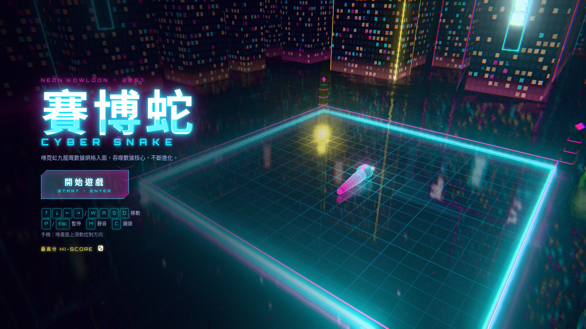
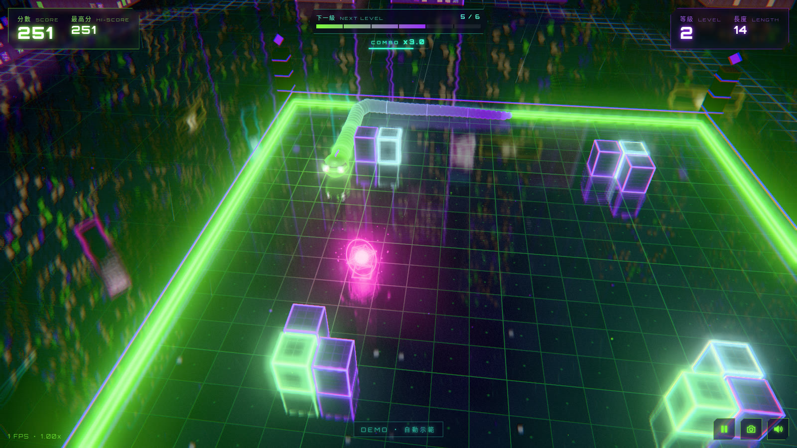
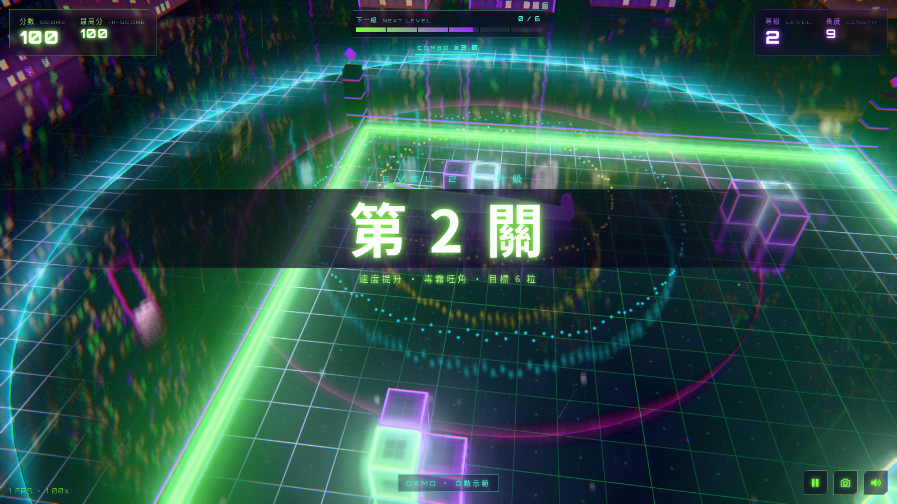

# 賽博蛇 CYBER SNAKE

霓虹九龍 · 2087 —— 一個用 Three.js 造嘅真 3D 賽博朋克貪食蛇。喺數據網格入面食晒啲數據核心，越食越長、越行越快！

**▶ 即刻玩：<https://fung2222.github.io/cyber-snake/>**
**▶ 自動示範：<https://fung2222.github.io/cyber-snake/?demo=1>**



| 遊戲中 | 升級 |
|---|---|
|  |  |

## 操作

| 按鍵 | 功能 |
|---|---|
| `↑ ↓ ← →` / `W A S D` | 移動（可預先輸入兩個轉向，唔可以 180° 掉頭） |
| `Enter` / `Space` | 開始 / 再嚟一鋪 |
| `P` / `Esc` | 暫停 |
| `M` | 靜音 |
| `C` | 切換鏡頭（追蹤 / 俯視） |
| `F` | 顯示 FPS |
| 手機 | 喺畫面上滑動控制方向 |

## 玩法

- 食數據核心會變長同加分；連續快速食會有 **Combo** 倍數加成。
- 每關食夠目標數量就升級：速度加快、出現新障礙物、霓虹色調轉換。
- 撞牆、撞自己或者撞障礙物 = 系統崩潰（Game Over）。
- 最高分會儲存喺瀏覽器（localStorage）。
- **無盡模式**：關卡永遠唔會完。第 6 關之後嘅障礙佈局係程式生成（每關固定種子），速度、目標數量同障礙數量都有上限，確保一直玩得落去；城市色調每關轉換。每 10 關係**里程碑**，送額外分數。最遠等級會記錄為無盡紀錄。

## 語言 Language
遊戲支援**繁體中文（香港）**同 **English**，喺主畫面或暫停畫面撳「EN／中」切換，會記住你嘅選擇（`localStorage cyber.lang`，所有 CYBER 遊戲共用）。網址加 `?lang=en` / `?lang=zh` 亦可。

## English
**CYBER SNAKE** is a true-3D cyberpunk snake game set in neon Kowloon, 2087. Eat data cores to grow, chain them quickly for combo multipliers, and dodge walls, obstacles and your own tail. **Endless mode:** levels never end — after the 6 hand-made arenas, obstacle layouts are generated procedurally per level, while speed, targets and obstacle count are capped so it stays playable; the city palette shifts every level, milestones every 10 levels award bonus points, and your best level is saved. Keyboard or swipe controls. Bilingual (Traditional Chinese / English) with an in-game toggle.

## 特色

- Three.js 真 3D 場景：反光網格地板、霓虹城市天際線、招牌、雨同浮塵粒子、霧
- UnrealBloom 霓虹光暈 + 自訂後期（色差、暗角、雜訊、故障效果）
- 平滑插值嘅蛇身、追蹤鏡頭、食嘢粒子爆發、衝擊波、升級橫幅、死亡震屏
- 所有音效同合成器背景音樂都係 Web Audio API 即時合成（無外部音檔）
- 無需 build，所有依賴（three.js r169、Orbitron 字型）已放喺 repo 入面，離線都玩得

## 本地運行

```bash
python3 -m http.server 8000
# 打開 http://localhost:8000/
```

URL 參數：`?demo=1` 自動示範、`?lang=en|zh` 語言、`?level=3` 由第 3 關開始、`?cam=top` 俯視鏡頭、`?fps=1` 顯示 FPS、`?nofade=1` 關閉遮擋淡出（測試用）。

文件：[docs/HANDOFF.md](docs/HANDOFF.md) · [privacy.html](privacy.html) · 屬於 [CYBER ARCADE](https://github.com/fung2222/cyber-arcade) 系列。
